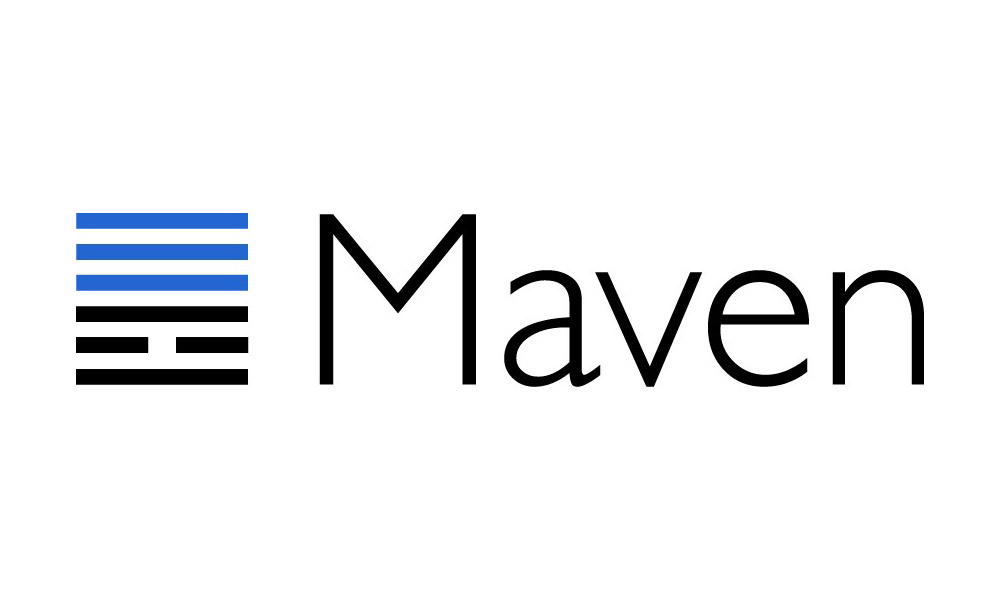

<br>


<br>
<br>

<p align="center">


</p>
<p>


Jalgorithm stems from
<a href="http://en.sbu.ac.ir/SitePages/Home.aspx">
 Shahid Beheshti University
</a>
</p>


### We loved Java and algorithms, so We made _Jalgorithm_ ❤

<br>
Jalgorithm is an open-source Java library which has implemented various algorithms and data structure
<br>
<br>
🚨The source code of the latest release resides on the main branch. The development branch has the latest changes, not published yet.
<br>
<br>

Data structure implemented so far:
 
- chained hash table
- direct-address table
- doubly linked list

Sort algorithms implemented so far:

- selection sort
- quick sort

<br>



### Add Jalgorithm to your projects

- [ Download JAR files manually](https://repo1.maven.org/maven2/io/github/muhammadkarbalaee/jalgorithm/)

- [ Inject via Gradle](https://search.maven.org/artifact/io.github.muhammadkarbalaee/jalgorithm/1.0.1/jar)
```groovy
implementation 'io.github.muhammadkarbalaee:jalgorithm:1.0.1'
```
- [ Inject via Maven](https://search.maven.org/artifact/io.github.muhammadkarbalaee/jalgorithm/1.0.1/jar)
```xml
<dependency>
  <groupId>io.github.muhammadkarbalaee</groupId>
  <artifactId>jalgorithm</artifactId>
  <version>1.0.1</version>
</dependency>
```


- [Any other dependency manager](https://mvnrepository.com/artifact/io.github.muhammadkarbalaee/jalgorithm)

### Wanna have a part in this thriving project?😍 
[ Join us on Slack](https://join.slack.com/t/jalgorithm/shared_invite/zt-119j0c542-P4jFxnNQblfn5q4WcanvWA)


<details>
  <summary>Support the team members by (buy😉) a cup of coffee 😊☕</summary>
  <a href="https://coffeebede.ir/buycoffee/muhammadksht">
    by Rials👇
    <br>
    </a>
    <br>
<br>
    <a href="https://link.trustwallet.com/send?coin=0&address=bc1q5pmusup3nrunesc3yezl6n83czyt29hds9lw42">
      by 
    </a>

```
bc1q5pmusup3nrunesc3yezl6n83czyt29hds9lw42
```

<a href="https://link.trustwallet.com/send?coin=60&address=0x9e0Bd006368E2b119b8c8AA01e117dbFd594d725">
  by 
</a>
     
```
0x9e0Bd006368E2b119b8c8AA01e117dbFd594d725
```

<a href="https://link.trustwallet.com/send?coin=3&address=DL3zvo932qkzAFBWtKBnoAwGU4hC2z15fA">
      by 
</a>
     
```
DL3zvo932qkzAFBWtKBnoAwGU4hC2z15fA
```


<a href="https://link.trustwallet.com/send?coin=60&address=0x9e0Bd006368E2b119b8c8AA01e117dbFd594d725&token_id=0x95aD61b0a150d79219dCF64E1E6Cc01f0B64C4cE">
      by 
</a>
     
```
0x9e0Bd006368E2b119b8c8AA01e117dbFd594d725
```

<a href="https://link.trustwallet.com/send?coin=195&address=TV67HV7wdeCNvLUWym1CCP238MzoM9xwje">
      by 
</a>
     
```
TV67HV7wdeCNvLUWym1CCP238MzoM9xwje
```


<a href="https://link.trustwallet.com/send?coin=195&address=TV67HV7wdeCNvLUWym1CCP238MzoM9xwje&token_id=TR7NHqjeKQxGTCi8q8ZY4pL8otSzgjLj6t">
      by 
</a>
     
```
TV67HV7wdeCNvLUWym1CCP238MzoM9xwje
```

<a href="mailto:muhammad.ksht@gmail.com">
     contact us for any other payment method you desire
     <br>
     
</a>
</details>  
<br>
<p align="center">

</p>


